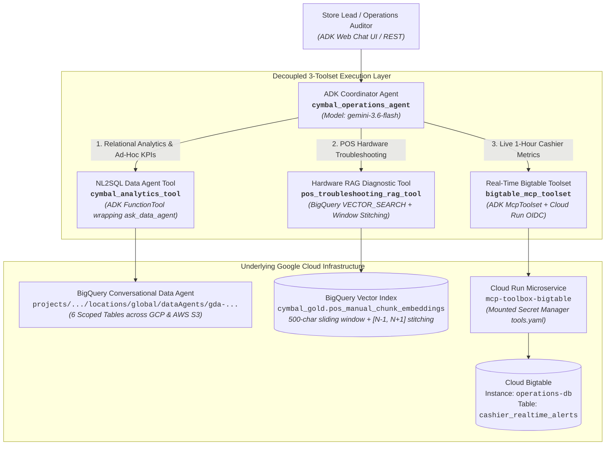

# Implementation Plan: Building & Orchestrating the Multi-Tool ADK Agent

## 📋 Executive Overview & Context

This implementation plan operationalizes **Module 3 Lab 3 (`03-module3-adk-handson-instructions.md`)**, detailing the design, scaffolding, tool implementation, Cloud Run microservice deployment, system prompt engineering, and end-to-end validation of the **Cymbal Retail Operations ADK Agent (`cymbal_operations_agent`)**.

* **Target GCP Project:** `praxis-magnet-508004-d7`
* **Target GCP Region:** `us-central1`
* **Coordinator Agent Name:** `cymbal_operations_agent`
* **Foundation LLM:** `gemini-3.6-flash` (or `gemini-2.5-flash` / `gemini-1.5-flash` via environment configuration)
* **Published BigQuery Data Agent:**
  * Resource Name: `projects/praxis-magnet-508004-d7/locations/global/dataAgents/gda-f0056a5c-197e-411e-9454-9da119bbf1c0`
  * Display Name: `Cymbal Retail Analytics Data Agent`
  * Location: `global` *(avoids mTLS routing errors)*
* **Bigtable Operational Database:**
  * Instance ID: `operations-db`
  * Table ID: `cashier_realtime_alerts`
  * Row Key Format: `STORE_{store_id:03d}#CASH_{cashier_id}` (e.g. `STORE_048#CASH_1190`)
* **Cloud Run MCP Microservice:**
  * Service Name: `mcp-toolbox-bigtable`
  * Container Image: `us-central1-docker.pkg.dev/database-toolbox/toolbox/toolbox:latest`
  * Configuration Secret: `bigtable-mcp-tools-secret` (Secret Manager)
* **Vector Search & RAG Foundation:**
  * Source Extracted Text: `praxis-magnet-508004-d7.module1_unstructureddata.pos_manual_generic_sections_extracted`
  * Baseline Embeddings: `praxis-magnet-508004-d7.module1_unstructureddata.pos_manual_embeddings` (Coarse, baseline reference)
  * Optimized Sliding-Window Embeddings: `praxis-magnet-508004-d7.cymbal_gold.pos_manual_chunk_embeddings` (500 char window, 100 char overlap)
  * Embedding Model: `text-embedding-005` (or `praxis-magnet-508004-d7.module1_unstructureddata.pos_text_embedding_model`)

---

## 🏛️ System Topology & Interaction Flow



---

## 📅 Phased Implementation Roadmap

### Phase 1: Environment Setup & Project Scaffolding (Challenge 1.1)

#### Objective
Scaffold the modular ADK agent repository structure using `agents-cli scaffold create`, create an isolated virtual environment, and configure environment variables.

#### Step-by-Step Execution

1. **Verify Cloudtop Credentials & Environment:**
   ```bash
   gcertstatus || gcert
   ```

2. **Scaffold the Agent Project:**
   ```bash
   cd /usr/local/google/home/pangyun/Projects/elevate-data-advanced/elevate-da-adv-day3-labs-agent
   agents-cli scaffold create cymbal_operations_agent --template default
   ```
   *Codebase Layout:*
   ```
   cymbal_operations_agent/
   ├── .env
   ├── requirements.txt
   ├── app/
   │   ├── __init__.py
   │   ├── agent.py                 # Coordinator agent definition & routing logic
   │   ├── prompts.py               # Intent-routing system instructions
   │   └── tools/
   │       ├── __init__.py
   │       ├── analytics_tool.py    # cymbal_analytics_tool (Data Agent API wrapper)
   │       ├── rag_tool.py          # pos_troubleshooting_rag_tool (BigQuery Vector Search)
   │       └── bigtable_tool.py     # bigtable_mcp_toolset (Cloud Run MCP client)
   └── tests/
       └── test_tools.py            # Isolated unit test verification
   ```

3. **Virtual Environment & Dependencies:**
   Set up virtual environment using `uv`:
   ```bash
   uv venv .venv
   source .venv/bin/activate
   ```
   Define `requirements.txt`:
   ```text
   google-adk==2.3.0
   mcp==1.29.0
   google-genai>=1.0.0
   google-cloud-bigquery>=3.25.0
   google-cloud-secret-manager>=2.20.0
   google-auth>=2.30.0
   requests>=2.31.0
   tenacity>=8.3.0
   python-dotenv>=1.0.0
   ```
   Install dependencies:
   ```bash
   uv pip install -r requirements.txt
   ```

4. **Environment Variables Configuration (`.env`):**
   ```bash
   PROJECT_ID="praxis-magnet-508004-d7"
   REGION="us-central1"
   DATA_AGENT_ID="gda-f0056a5c-197e-411e-9454-9da119bbf1c0"
   DATA_AGENT_RESOURCE_NAME="projects/praxis-magnet-508004-d7/locations/global/dataAgents/gda-f0056a5c-197e-411e-9454-9da119bbf1c0"
   DATA_AGENT_LOCATION="global"
   BIGTABLE_INSTANCE_ID="operations-db"
   BIGTABLE_TABLE_ID="cashier_realtime_alerts"
   BIGTABLE_MCP_URL="" # Populated dynamically after Phase 4 deployment
   COORDINATOR_MODEL="gemini-3.6-flash"
   ```

#### Verification Gate 1
* `uv pip list` confirms `google-adk==2.3.0` and `mcp==1.29.0` installed without conflicts.
* Python import verification succeeds: `python -c "import google.adk; import mcp; print('ADK & MCP Ready')"`

---

### Phase 2: Implement NL2SQL Data Agent Tool (Challenge 2.1)

#### Objective
Implement `cymbal_analytics_tool` wrapping the BigQuery Conversational Data Agent API, incorporating exponential backoff retries, user-friendly fallback messaging, and verbatim passing of enterprise business glossary terms.

#### Architectural Rationale
While static operational metrics could theoretically use hardcoded SQL templates, real-world store operators require arbitrary, open-ended natural language questions (e.g. comparing store revenue to warranty claim rates). The BigQuery Data Agent provides dynamic schema discovery and real-time GoogleSQL generation over the 6 conformed tables.

#### Technical Implementation (`app/tools/analytics_tool.py`)

```python
"""Analytics Tool wrapping BigQuery Conversational Data Agent API."""

import logging
import os
import time
from typing import Optional
from tenacity import retry, stop_after_attempt, wait_exponential, retry_if_exception_type
import google.adk.tools.data_agent.data_agent_tool as data_agent_tool
from google.adk.tools import FunctionTool

logger = logging.getLogger(__name__)

DATA_AGENT_RESOURCE = os.getenv(
    "DATA_AGENT_RESOURCE_NAME",
    "projects/praxis-magnet-508004-d7/locations/global/dataAgents/gda-f0056a5c-197e-411e-9454-9da119bbf1c0"
)
DATA_AGENT_LOCATION = os.getenv("DATA_AGENT_LOCATION", "global")

# If regional endpoint was used, apply base URL override:
if DATA_AGENT_LOCATION != "global":
    data_agent_tool.BASE_URL = f"https://geminidataanalytics.{DATA_AGENT_LOCATION}.rep.googleapis.com/v1beta"

@retry(
    stop=stop_after_attempt(3),
    wait=wait_exponential(multiplier=1, min=2, max=10),
    retry_error_callback=lambda retry_state: "Transient error: Store analytics service temporarily unavailable after 3 attempts."
)
def _call_data_agent_with_retry(prompt: str) -> str:
    """Invokes ask_data_agent with exponential backoff."""
    return data_agent_tool.ask_data_agent(
        data_agent_name=DATA_AGENT_RESOURCE,
        prompt=prompt
    )

def query_retail_analytics(user_query: str) -> str:
    """Queries conformed enterprise retail analytics in Google Cloud BigQuery and federated AWS S3.
    
    Use this tool for:
    - Today's intraday sales transactions, net revenue, and units sold.
    - Store inventory levels, on-hand counts, and stockout risk (<20 hours cover).
    - Customer historical purchase records and warranty eligibility lookups.
    - Multi-day cashier promo abuse and anomaly alert rankings (GCP).
    - Cross-cloud transaction log auditing in federated AWS S3.
    
    Args:
        user_query: The natural language question. Standard business glossary terms 
                    (e.g., 'Net Transaction Revenue', 'Total On-Hand Inventory', 
                    'Estimated Cover Hours', 'Cashier Promo Override Rate') 
                    must be preserved verbatim.
    Returns:
        Structured relational query findings, data tables, and analysis from the BigQuery Data Agent.
    """
    try:
        logger.info(f"Dispatching query to BigQuery Data Agent: {user_query}")
        result = _call_data_agent_with_retry(user_query)
        if not result or not str(result).strip():
            return "No matching records found in the retail analytics ledger."
        return str(result)
    except Exception as e:
        logger.error(f"Failed to query Data Agent: {e}", exc_info=True)
        return (
            "Store data is currently unreachable due to a temporary network or service disruption. "
            "Please verify database connectivity or retry in a few moments."
        )

# Export as ADK Tool
cymbal_analytics_tool = FunctionTool(
    func=query_retail_analytics,
    name="cymbal_analytics_tool",
    description="Query relational retail data across BigQuery Gold tables and federated AWS S3 checkout logs."
)
```

#### Verification Gate 2
* Standalone execution of `query_retail_analytics("What is today's total intraday net revenue by store?")` returns aggregated revenue data.
* Error simulation (malformed resource name) triggers the user-friendly fallback message without crashing the process.

---

### Phase 3: Optimize POS RAG Tool with Sliding-Window Chunking & Adjacent Window Stitching (Challenge 2.2)

#### Objective
Demonstrate the retrieval limitation of coarse Module 1 embeddings on hardware error codes (`ERR-PAY-4001`), re-chunk documents into 500-character sliding windows with BigQuery ML, implement adjacent context stitching ($N-1$ to $N+1$), and build `pos_troubleshooting_rag_tool` with similarity guardrails and GCS HTTPS link conversion.

#### 1. Analyze Module 1 Baseline Retrieval Dilution
* **Issue:** Coarse chunks (`module1_unstructureddata.pos_manual_embeddings`) dilute specific hardware fault codes (e.g. `ERR-PAY-4001 EMV reader freeze`) across thousands of characters.
* **Result:** Cosine distance is high (`similarity = 1 - distance < 0.70`), failing similarity thresholds.

#### 2. Redo Sliding-Window Chunking in BigQuery
Execute GoogleSQL to create `praxis-magnet-508004-d7.cymbal_gold.pos_manual_chunk_embeddings`:

```sql
CREATE OR REPLACE TABLE `praxis-magnet-508004-d7.cymbal_gold.pos_manual_chunk_embeddings` AS
WITH chunk_offsets AS (
  SELECT
    document_filename,
    document_title,
    equipment_covered,
    source_pdf_uri,
    offset_pos,
    OFFSET AS chunk_index,
    SUBSTR(extracted_full_content, offset_pos, 500) AS chunk_content
  FROM
    `praxis-magnet-508004-d7.module1_unstructureddata.pos_manual_generic_sections_extracted`,
    UNNEST(GENERATE_ARRAY(1, GREATEST(LENGTH(extracted_full_content), 1), 400)) AS offset_pos WITH OFFSET
)
SELECT
  document_filename,
  document_title,
  equipment_covered,
  source_pdf_uri,
  chunk_index,
  chunk_content
FROM
  chunk_offsets
WHERE
  LENGTH(TRIM(chunk_content)) > 30;
```

#### 3. Re-Generate Dense Embeddings with BigQuery ML
Add the embedding vector column and generate embeddings using `text-embedding-005`:

```sql
-- Alter table to add embedding vector column
ALTER TABLE `praxis-magnet-508004-d7.cymbal_gold.pos_manual_chunk_embeddings`
ADD COLUMN IF NOT EXISTS embedding ARRAY<FLOAT64>;

-- Generate embeddings and update table
UPDATE `praxis-magnet-508004-d7.cymbal_gold.pos_manual_chunk_embeddings` target
SET target.embedding = emb.ml_generate_embedding_result
FROM (
  SELECT
    document_filename,
    chunk_index,
    ml_generate_embedding_result
  FROM
    ML.GENERATE_EMBEDDING(
      MODEL `praxis-magnet-508004-d7.module1_unstructureddata.pos_text_embedding_model`,
      (
        SELECT
          document_filename,
          chunk_index,
          CONCAT('[', document_title, ']\n', chunk_content) AS content
        FROM
          `praxis-magnet-508004-d7.cymbal_gold.pos_manual_chunk_embeddings`
      ),
      STRUCT('RETRIEVAL_DOCUMENT' AS task_type)
    )
) emb
WHERE target.document_filename = emb.document_filename
  AND target.chunk_index = emb.chunk_index;
```

#### 4. GoogleSQL Adjacent Context Window Stitching Query
Query vector similarity with `COSINE` distance and aggregate surrounding chunks ($N-1$, $N$, $N+1$):

```sql
WITH top_match AS (
  SELECT
    base.document_filename,
    base.document_title,
    base.equipment_covered,
    base.source_pdf_uri,
    base.chunk_index,
    ROUND(1.0 - distance, 4) AS similarity_score
  FROM
    VECTOR_SEARCH(
      TABLE `praxis-magnet-508004-d7.cymbal_gold.pos_manual_chunk_embeddings`,
      'embedding',
      (
        SELECT ml_generate_embedding_result AS embedding
        FROM ML.GENERATE_EMBEDDING(
          MODEL `praxis-magnet-508004-d7.module1_unstructureddata.pos_text_embedding_model`,
          (SELECT @query_text AS content),
          STRUCT('RETRIEVAL_QUERY' AS task_type)
        )
      ),
      top_k => 1,
      distance_type => 'COSINE'
    )
),
stitched_context AS (
  SELECT
    m.document_filename,
    m.document_title,
    m.equipment_covered,
    m.source_pdf_uri,
    m.similarity_score,
    STRING_AGG(c.chunk_content, '\n' ORDER BY c.chunk_index ASC) AS full_troubleshooting_runbook
  FROM
    top_match m
  JOIN
    `praxis-magnet-508004-d7.cymbal_gold.pos_manual_chunk_embeddings` c
  ON
    m.document_filename = c.document_filename
    AND c.chunk_index BETWEEN (m.chunk_index - 1) AND (m.chunk_index + 1)
  GROUP BY
    m.document_filename, m.document_title, m.equipment_covered, m.source_pdf_uri, m.similarity_score
)
SELECT * FROM stitched_context;
```

#### 5. Technical Implementation (`app/tools/rag_tool.py`)

```python
"""POS Hardware Troubleshooting RAG Tool with Adjacent Context Stitching & Guardrails."""

import logging
import os
import re
from google.cloud import bigquery
from google.adk.tools import FunctionTool
from tenacity import retry, stop_after_attempt, wait_exponential

logger = logging.getLogger(__name__)

PROJECT_ID = os.getenv("PROJECT_ID", "praxis-magnet-508004-d7")
SIMILARITY_THRESHOLD = 0.70

client = bigquery.Client(project=PROJECT_ID)

def _convert_gcs_uri_to_https(gcs_uri: str) -> str:
    """Converts gs:// bucket URIs to authenticated HTTPS links."""
    if not gcs_uri:
        return ""
    if gcs_uri.startswith("gs://"):
        return gcs_uri.replace("gs://", "https://storage.cloud.google.com/")
    return gcs_uri

@retry(stop=stop_after_attempt(3), wait=wait_exponential(multiplier=1, min=2, max=6))
def _run_stitched_vector_search(query: str):
    sql = f"""
    WITH top_match AS (
      SELECT
        base.document_filename,
        base.document_title,
        base.equipment_covered,
        base.source_pdf_uri,
        base.chunk_index,
        ROUND(1.0 - distance, 4) AS similarity_score
      FROM
        VECTOR_SEARCH(
          TABLE `{PROJECT_ID}.cymbal_gold.pos_manual_chunk_embeddings`,
          'embedding',
          (
            SELECT ml_generate_embedding_result AS embedding
            FROM ML.GENERATE_EMBEDDING(
              MODEL `{PROJECT_ID}.module1_unstructureddata.pos_text_embedding_model`,
              (SELECT @query_text AS content),
              STRUCT('RETRIEVAL_QUERY' AS task_type)
            )
          ),
          top_k => 1,
          distance_type => 'COSINE'
        )
    ),
    stitched_context AS (
      SELECT
        m.document_filename,
        m.document_title,
        m.equipment_covered,
        m.source_pdf_uri,
        m.similarity_score,
        STRING_AGG(c.chunk_content, '\n' ORDER BY c.chunk_index ASC) AS full_runbook
      FROM
        top_match m
      JOIN
        `{PROJECT_ID}.cymbal_gold.pos_manual_chunk_embeddings` c
      ON
        m.document_filename = c.document_filename
        AND c.chunk_index BETWEEN (m.chunk_index - 1) AND (m.chunk_index + 1)
      GROUP BY
        m.document_filename, m.document_title, m.equipment_covered, m.source_pdf_uri, m.similarity_score
    )
    SELECT * FROM stitched_context LIMIT 1;
    """
    job_config = bigquery.QueryJobConfig(
        query_parameters=[bigquery.ScalarQueryParameter("query_text", "STRING", query)]
    )
    return list(client.query(sql, job_config=job_config).result())

def _run_fulltext_search_fallback(query: str):
    """Fallback to BigQuery SEARCH() function if vector similarity is below threshold."""
    sql = f"""
    SELECT
      document_filename,
      document_title,
      equipment_covered,
      source_pdf_uri,
      0.65 AS similarity_score,
      chunk_content AS full_runbook
    FROM
      `{PROJECT_ID}.cymbal_gold.pos_manual_chunk_embeddings`
    WHERE
      SEARCH(chunk_content, @query_text)
    ORDER BY chunk_index ASC
    LIMIT 1;
    """
    job_config = bigquery.QueryJobConfig(
        query_parameters=[bigquery.ScalarQueryParameter("query_text", "STRING", query)]
    )
    return list(client.query(sql, job_config=job_config).result())

def troubleshoot_pos_hardware(diagnostic_query: str) -> str:
    """Searches official POS hardware engineering manuals for troubleshooting runbooks and error codes.
    
    Use this tool when users ask about:
    - POS hardware error codes (e.g. ERR-PAY-4001, ERR-DN-PRNT-24V).
    - EMV terminal contactless payment freezes and recovery procedures.
    - Thermal receipt printer jams, cutter locks, and power supplies.
    - Barcode scanner configuration and hardware diagnostic steps.
    
    Args:
        diagnostic_query: The technical hardware error or diagnostic query.
    Returns:
        Stitched procedural runbook, equipment model, and certified GCS manual link.
    """
    try:
        rows = _run_stitched_vector_search(diagnostic_query)
        
        # Check threshold
        if rows and rows[0].similarity_score >= SIMILARITY_THRESHOLD:
            row = rows[0]
        else:
            # Attempt full-text fallback
            fallback_rows = _run_fulltext_search_fallback(diagnostic_query)
            if fallback_rows:
                row = fallback_rows[0]
            else:
                return (
                    "⚠️ WARNING: No certified POS hardware documentation found matching this query. "
                    "The requested equipment or topic is out-of-scope for Cymbal Retail POS hardware maintenance."
                )

        https_link = _convert_gcs_uri_to_https(row.source_pdf_uri)
        return (
            f"### POS Hardware Field Diagnostic Runbook\n"
            f"- **Equipment Covered:** {row.equipment_covered}\n"
            f"- **Manual Document:** {row.document_title} (`{row.document_filename}`)\n"
            f"- **Relevance Score:** {row.similarity_score}\n"
            f"- **Certified Manual URL:** [{row.document_title}]({https_link})\n\n"
            f"#### Procedural Instructions:\n"
            f"{row.full_runbook}\n"
        )
    except Exception as e:
        logger.error(f"Error executing POS RAG search: {e}", exc_info=True)
        return (
            "Hardware diagnostic service is currently unavailable. "
            "Please consult the physical store runbook or escalate to Store IT Operations."
        )

pos_troubleshooting_rag_tool = FunctionTool(
    func=troubleshoot_pos_hardware,
    name="pos_troubleshooting_rag_tool",
    description="Retrieve certified POS hardware troubleshooting procedures, error codes, and runbooks."
)
```

#### Verification Gate 3
* Querying `ERR-PAY-4001` returns Toshiba TCx 810 instructions with similarity $\ge 0.70$ and authenticated HTTPS link.
* Querying out-of-scope topic (`Ford F-150 engine oil`) returns the certified warning fallback.

---

### Phase 4: Configure & Deploy Bigtable MCP Microservice (Challenge 2.3)

#### Objective
Author `tools.yaml`, save it to Secret Manager (`bigtable-mcp-tools-secret`), deploy `mcp-toolbox-bigtable` to Cloud Run, and implement `bigtable_mcp_toolset` in ADK using OIDC authentication.

#### 1. Author `tools.yaml` Configuration
Create `mcp_config/tools.yaml`:

```yaml
sources:
  bigtable-source:
    kind: bigtable
    project: praxis-magnet-508004-d7
    instance: operations-db

tools:
  read_cashier_realtime_metrics:
    source: bigtable-source
    description: "Reads live 1-hour rolling metrics and audit status flags for a cashier by row key."
    table: cashier_realtime_alerts
    read:
      row:
        key: "{{row_key}}"

  scan_cashier_alerts_by_store:
    source: bigtable-source
    description: "Scans live cashier alerts and rolling metrics for a store by row key prefix (e.g. STORE_048#)."
    table: cashier_realtime_alerts
    read:
      prefix: "{{store_prefix}}"
```

#### 2. Provision Secret in Secret Manager
```bash
# Create secret
gcloud secrets create bigtable-mcp-tools-secret \
    --replication-policy="automatic" \
    --project="praxis-magnet-508004-d7"

# Upload tools.yaml payload
gcloud secrets versions add bigtable-mcp-tools-secret \
    --data-file="mcp_config/tools.yaml" \
    --project="praxis-magnet-508004-d7"
```

#### 3. Grant Secret Access to Cloud Run Default Service Account
Ensure Compute Engine default service account (`<PROJECT_NUM>-compute@developer.gserviceaccount.com`) has `Secret Manager Secret Accessor` role:
```bash
PROJECT_NUM=$(gcloud projects describe praxis-magnet-508004-d7 --format="value(projectNumber)")

gcloud secrets add-iam-policy-binding bigtable-mcp-tools-secret \
    --member="serviceAccount:${PROJECT_NUM}-compute@developer.gserviceaccount.com" \
    --role="roles/secretmanager.secretAccessor" \
    --project="praxis-magnet-508004-d7"

gcloud projects add-iam-policy-binding praxis-magnet-508004-d7 \
    --member="serviceAccount:${PROJECT_NUM}-compute@developer.gserviceaccount.com" \
    --role="roles/bigtable.reader"
```

#### 4. Deploy `mcp-toolbox-bigtable` to Cloud Run
Deploy the official Database Toolbox container:
```bash
gcloud run deploy mcp-toolbox-bigtable \
    --image="us-central1-docker.pkg.dev/database-toolbox/toolbox/toolbox:latest" \
    --region="us-central1" \
    --project="praxis-magnet-508004-d7" \
    --set-secrets="/etc/toolbox/tools.yaml=bigtable-mcp-tools-secret:latest" \
    --set-env-vars="TOOLBOX_CONFIG=/etc/toolbox/tools.yaml" \
    --no-allow-unauthenticated \
    --port=8080
```
Retrieve Cloud Run Service URL:
```bash
BIGTABLE_MCP_URL=$(gcloud run services describe mcp-toolbox-bigtable \
    --region="us-central1" \
    --project="praxis-magnet-508004-d7" \
    --format="value(status.url)")
echo "BIGTABLE_MCP_URL=${BIGTABLE_MCP_URL}"
```

#### 5. Implement `bigtable_mcp_toolset` (`app/tools/bigtable_tool.py`)

```python
"""Cloud Bigtable MCP Toolset connecting to Cloud Run microservice with OIDC authentication."""

import logging
import os
import google.auth
import google.auth.transport.requests
from google.oauth2 import id_token
from google.adk.tools.mcp_tool import McpToolset
from google.adk.tools import FunctionTool
import requests

logger = logging.getLogger(__name__)

MCP_SERVICE_URL = os.getenv("BIGTABLE_MCP_URL")

def _get_oidc_token(audience: str) -> str:
    """Generates GCP OIDC ID token for authenticated Cloud Run service."""
    auth_req = google.auth.transport.requests.Request()
    return id_token.fetch_id_token(auth_req, audience)

def query_bigtable_cashier_metrics(store_id: int, cashier_id: str) -> str:
    """Queries Cloud Bigtable for real-time 1-hour rolling metrics for a cashier.
    
    Args:
        store_id: Integer ID of the store (e.g., 48).
        cashier_id: String ID of the cashier (e.g., 'CASH_1190' or '1190').
    Returns:
        Real-time audit flags, live override rate, void counts, and anomaly status.
    """
    clean_cashier = cashier_id if cashier_id.startswith("CASH_") else f"CASH_{cashier_id}"
    row_key = f"STORE_{int(store_id):03d}#{clean_cashier}"
    
    if not MCP_SERVICE_URL:
        # Direct Bigtable SDK fallback if MCP URL not yet configured
        return _fallback_direct_bigtable_read(row_key)
        
    try:
        token = _get_oidc_token(MCP_SERVICE_URL)
        headers = {
            "Authorization": f"Bearer {token}",
            "Content-Type": "application/json"
        }
        payload = {
            "method": "tools/call",
            "params": {
                "name": "read_cashier_realtime_metrics",
                "arguments": {"row_key": row_key}
            }
        }
        resp = requests.post(f"{MCP_SERVICE_URL}/mcp", json=payload, headers=headers, timeout=10)
        resp.raise_for_status()
        return str(resp.json())
    except Exception as e:
        logger.warning(f"MCP service call failed: {e}. Attempting direct fallback.")
        return _fallback_direct_bigtable_read(row_key)

def _fallback_direct_bigtable_read(row_key: str) -> str:
    """Direct Bigtable SDK fallback."""
    from google.cloud import bigtable
    client = bigtable.Client(project=os.getenv("PROJECT_ID", "praxis-magnet-508004-d7"), admin=False)
    instance = client.instance(os.getenv("BIGTABLE_INSTANCE_ID", "operations-db"))
    table = instance.table(os.getenv("BIGTABLE_TABLE_ID", "cashier_realtime_alerts"))
    row = table.read_row(row_key.encode("utf-8"))
    if not row:
        return f"No real-time metrics found in Bigtable for row key '{row_key}'."
    
    parsed = {}
    for col_family, cols in row.cells.items():
        parsed[col_family] = {}
        for col_name, cell_list in cols.items():
            parsed[col_family][col_name.decode("utf-8")] = cell_list[0].value.decode("utf-8", errors="replace")
    return f"Live Bigtable Metrics for {row_key}: {parsed}"

bigtable_mcp_tool = FunctionTool(
    func=query_bigtable_cashier_metrics,
    name="query_bigtable_cashier_metrics",
    description="Query live 1-hour rolling metrics and audit status flags for a cashier from Cloud Bigtable."
)
```

#### Verification Gate 4
* Test read on row key `STORE_048#CASH_1190` returns rolling metrics and status flags.
* Cloud Run logs show successful `200 OK` on `/mcp` requests.

---

### Phase 5: Coordinator Agent Binding & System Prompts (Challenge 3.1)

#### Objective
Define the root coordinator agent (`cymbal_operations_agent`) using `gemini-3.6-flash`, bind the 3 toolsets, and formulate intent-routing system instructions supporting single-tool dispatch, parallel dispatch, and sequential multi-turn workflows.

#### System Instructions Formulation (`app/prompts.py`)

```python
"""Intent-Routing System Instructions for Cymbal Retail Operations Agent."""

SYSTEM_INSTRUCTIONS = """
You are the Cymbal Retail Operations Coordinator Agent (cymbal_operations_agent), an enterprise operational AI assistant serving store managers, loss prevention leads, and district auditors.

You orchestrate three specialized tools:
1. `cymbal_analytics_tool`: Relational data agent accessing conformed BigQuery Gold tables and federated AWS S3 BigLake storage.
2. `pos_troubleshooting_rag_tool`: Vector search engine over official POS hardware technical engineering manuals.
3. `query_bigtable_cashier_metrics`: Real-time operational key-value store querying 1-hour rolling cashier metrics from Cloud Bigtable.

---

### 🚦 Intent Routing & Tool Execution Protocol

#### Mode A: Single-Tool Dispatch
- **Hardware Failures & Error Codes:** When queries mention hardware errors, POS terminal freezes, printer paper cutter locks, or scanner diagnostics (e.g. "ERR-PAY-4001", "thermal cutter lock"):
  - Call `pos_troubleshooting_rag_tool`.
  - Always surface the certified manual PDF link and equipment model.
- **Relational Analytics & Inventory:** When queries ask about intraday net revenue, inventory stockouts (<20h cover), past customer purchases, or warranty terms:
  - Call `cymbal_analytics_tool`.
  - Preserve standard business glossary terms verbatim ('Net Transaction Revenue', 'Total On-Hand Inventory', 'Estimated Cover Hours').
- **Live Cashier Status:** When queries ask strictly for live 1-hour cashier metrics or real-time flags:
  - Call `query_bigtable_cashier_metrics` with `store_id` and `cashier_id`.

#### Mode B: Parallel Tool Dispatch (Turn 1 Concurrency)
- **Scenario:** Dual Cashier Baseline Comparison (e.g., "What is Cashier CASH_1190's live 1-hour override rate right now, compared to their 7-day historical override baseline?"):
  - In a SINGLE TURN, invoke BOTH tools concurrently:
    1. `query_bigtable_cashier_metrics(store_id=..., cashier_id="CASH_1190")` for live 1-hour override rate.
    2. `cymbal_analytics_tool(user_query="...")` for 7-day historical override baseline from `pos_anomaly_alerts`.
  - Synthesize the comparison in your final answer, computing any variance.

#### Mode C: Sequential Multi-Turn Dispatch
- **Scenario:** Cross-Cloud Promo Offender Investigation (e.g., "Show cashiers with active cashier promo abuse alerts in the last 7 days and retrieve checkout logs for the top offender"):
  - **Turn 1:** Call `cymbal_analytics_tool` to rank cashiers with promo abuse alerts over the last 7 days from `pos_anomaly_alerts`.
  - **Turn 2:** Identify the #1 offending cashier ID from Turn 1 results, then call `cymbal_analytics_tool` requesting checkout logs from AWS S3 (`silver_pos_transactions`) for that specific cashier.
  - Synthesize findings into an executive fraud report.

---

### 🛡️ Safety, Grounding & Output Standards
- Never guess hardware error fixes; rely strictly on `pos_troubleshooting_rag_tool`. If out-of-scope, display the certified warning.
- Always provide clickable markdown links for source PDF documentation.
- When reporting currency, format as USD with two decimal places ($XX.XX).
"""
```

#### Coordinator Agent Definition (`app/agent.py`)

```python
"""Root Coordinator Agent Definition."""

import os
from google.adk import Agent
from app.prompts import SYSTEM_INSTRUCTIONS
from app.tools.analytics_tool import cymbal_analytics_tool
from app.tools.rag_tool import pos_troubleshooting_rag_tool
from app.tools.bigtable_tool import bigtable_mcp_tool

MODEL_NAME = os.getenv("COORDINATOR_MODEL", "gemini-3.6-flash")

cymbal_operations_agent = Agent(
    name="cymbal_operations_agent",
    model=MODEL_NAME,
    instructions=SYSTEM_INSTRUCTIONS,
    tools=[
        cymbal_analytics_tool,
        pos_troubleshooting_rag_tool,
        bigtable_mcp_tool
    ]
)
```

---

### Phase 6: Local Validation & Operational Test Suite (Challenge 4.1)

#### Objective
Run the ADK Web UI (`adk web app`), execute the 7 target business scenarios, inspect ADK trace waterfalls, and verify compliance against the Feedback Server.

#### Operational Test Matrix

| Test ID | Business Scenario | Input Test Prompt | Expected Routing & Waterfall Behavior | Verification Success Criteria |
| :--- | :--- | :--- | :--- | :--- |
| **UC 1.1a** | Hardware Error Code | *"What is the immediate field recovery protocol when a cashier encounters an ERR-PAY-4001 EMV contactless payment freeze, and how do we ensure the customer is not double-charged?"* | Single dispatch to `pos_troubleshooting_rag_tool`. | Returns Toshiba TCx 810 instructions with clickable GCS HTTPS link and $\ge 0.70$ similarity. |
| **UC 1.1c** | Out-of-Scope Hardware | *"How do I replace the engine oil on a Ford F-150 truck?"* | Single dispatch to `pos_troubleshooting_rag_tool`. | Fallback triggered; returns certified warning without hallucinating. |
| **UC 1.2a** | Stockout Risk (<20h) | *"What is the estimated cover hours remaining for store inventory positions experiencing stockout risk of less than 20 hours, and what is their total on-hand inventory?"* | Single dispatch to `cymbal_analytics_tool`. | Queries `gold_inventory_reconciliation_ledger` filtering `< 20.0` cover hours and sums `shelf_qty + backroom_qty`. |
| **UC 1.3** | Real-Time Cashier Metrics | *"Read live 1-hour rolling metrics and audit status flags for Cashier CASH_1190 at Store 48."* | Single dispatch to `query_bigtable_cashier_metrics`. | Bigtable row key `STORE_048#CASH_1190` queried; returns live metrics and flags. |
| **UC 2.1a** | Past Warranty Lookup | *"Check transaction details for TXN-20260312-0015811 and show the warranty coverage policy for the purchased item."* | Single dispatch to `cymbal_analytics_tool`. | Unnests `tx.items` in `historical_transactional_data` and joins `warranty_generic_sections_extracted`. |
| **UC 2.2** | Dual Cashier Baseline | *"What is Cashier CASH_1190's live 1-hour override rate right now, compared to their 7-day historical override baseline?"* | **Parallel Dispatch:** Turn 1 invokes `query_bigtable_cashier_metrics` AND `cymbal_analytics_tool` simultaneously. | Trace waterfall confirms parallel tool call; final response contrasts live vs. historical rates. |
| **UC 2.3** | Cross-Cloud Offender Audit | *"Show cashiers with active cashier promo abuse alerts in the last 7 days and retrieve checkout logs for the top offender."* | **Sequential Dispatch:** Turn 1 identifies top offender in GCP `pos_anomaly_alerts` -> Turn 2 queries AWS S3 `silver_pos_transactions`. | Trace waterfall shows 2 distinct sequential analytical turns; outputs cross-cloud audit table. |

#### Feedback Server Readiness Check
1. Navigate to: `https://elevate-evaluation-preprod.aishprabhat.demo.altostrat.com/?track=data`
2. Run the **Agent Codebase Readiness** check.
3. Review automated evaluation trace results and iterate on system prompt or tool descriptions as needed.

---

### Phase 7: Bonus Production Hardening (Challenge 5)

#### 1. End-User OAuth Authentication (Delegated Access)
* Pass user-delegated OAuth bearer tokens into BigQuery client sessions using ADK external access tokens to enforce IAM access per employee.

#### 2. Query Cost & Resource Guardrails
* Enforce `maximum_bytes_billed = 100 * 1024 * 1024` (100 MB limit) on BigQuery query job configs to eliminate accidental full table scans.

#### 3. Semantic Search via Autonomous Embeddings (`store_name` ↔ `store_id`)
* Generate vector embeddings on store names in `gold_inventory_reconciliation_ledger` allowing fuzzy resolution (e.g., *"Downtown Chicago Flagship"* $\rightarrow$ `store_id = 9`).

#### 4. Multi-Tenant Data Isolation (Row-Level Security)
* Create BigQuery Row-Level Security (RLS) policies on `pos_transactions_gold` and `gold_inventory_reconciliation_ledger` restricting row access via `SESSION_USER()`.

---

## 🔒 Security, Compliance & Governance Checklist

- [ ] **Data Agent Resource Scope:** Only 6 authorized conformed tables exposed; no DDL/DML capabilities.
- [ ] **Secret Manager Storage:** Database Toolbox configuration (`tools.yaml`) stored encrypted at rest.
- [ ] **Cloud Run Ingress & Auth:** Cloud Run deployed with `--no-allow-unauthenticated`; caller authenticated via Google OIDC ID token.
- [ ] **Threshold Guardrail:** RAG tool strictly enforces $0.70$ cosine similarity threshold before returning manual contents.
- [ ] **PII Protection:** Customer payment card numbers masked in query outputs.

---

## 🏁 Summary of Deliverables & Artifacts

1. **Repository Structure:** Clean modular ADK project (`app/agent.py`, `app/prompts.py`, `app/tools/`).
2. **BigQuery Table:** `praxis-magnet-508004-d7.cymbal_gold.pos_manual_chunk_embeddings` with 500-character chunks and dense vector embeddings.
3. **Cloud Run Service:** `mcp-toolbox-bigtable` running database toolbox with Secret Manager integration.
4. **Agent Definition:** `cymbal_operations_agent` binding 3 tools with single, parallel, and sequential orchestration.
5. **Validation Evidence:** Execution traces across all 7 operational scenarios and Feedback Server score verification.
