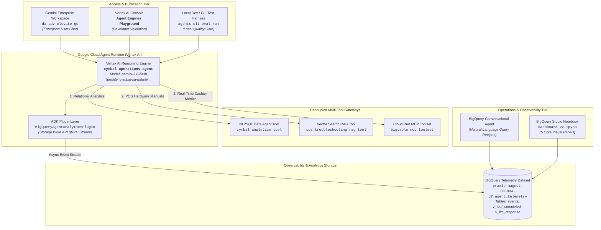
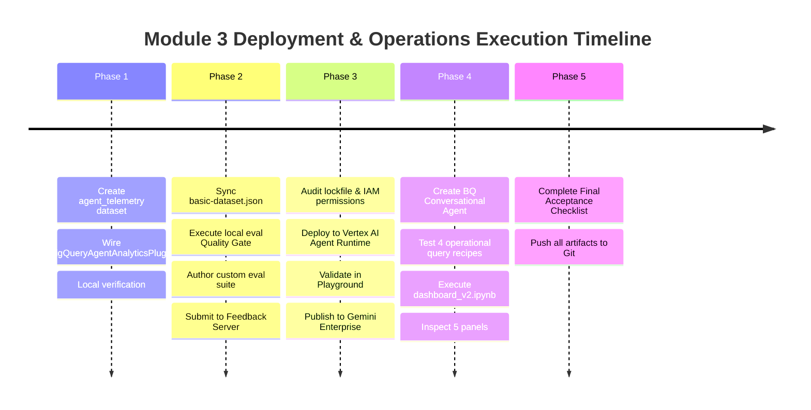

# Implementation Plan: Module 3 Agent Logging, Evaluation, Cloud Deployment & Operations Monitoring

## 📋 Executive Overview & Context

This implementation plan operationalizes **Module 3 Lab 4 (`04-module3-deployment-handson-instructions.md`)**, detailing the architecture, configuration, evaluation suite, Cloud deployment to Vertex AI Agent Runtime, publication to Gemini Enterprise, and BigQuery Agent Analytics telemetry monitoring for the **Cymbal Retail Operations ADK Agent (`cymbal_operations_agent`)**.

* **Target GCP Project ID:** `praxis-magnet-508004-d7`
* **Target GCP Region:** `us-central1`
* **Coordinator Agent Name:** `cymbal_operations_agent`
* **Foundation Model:** `gemini-3.6-flash`
* **Deployment Target:** `agent_runtime` (Serverless Vertex AI Reasoning Engine)
* **Reasoning Engine Service Account:** `cymbal-sa-data@praxis-magnet-508004-d7.iam.gserviceaccount.com`
* **Telemetry BigQuery Dataset:** `agent_telemetry` (Location: `us-central1`)
* **Gemini Enterprise Application:** `da-adv-elevate-ge`
* **Agent Repository Root:** `/usr/local/google/home/pangyun/Projects/elevate-data-advanced/da-advance-eval/cymbal-operations-agent`
* **Remote Git Repository:** `https://github.com/epapayu/da-advance-eval`

---

## 🏛️ End-to-End System Architecture



---

## 📅 Phased Implementation Roadmap



---

## Phase 1: Logging (BigQueryAgentAnalyticsPlugin Configuration)

### Challenge 1.1: Create BigQuery Telemetry Dataset

#### Objective
Provision a dedicated BigQuery dataset in `us-central1` to ingest, partition, and store real-time telemetry events emitted by the agent runtime.

#### Implementation Steps
1. Execute the `bq mk` command with location `us-central1`:
   ```bash
   bq --location=us-central1 mk -d \
     --description "ADK agent telemetry event store for Cymbal Operations Agent" \
     praxis-magnet-508004-d7:agent_telemetry
   ```
2. Verify dataset provisioning:
   ```bash
   bq show --format=prettyjson praxis-magnet-508004-d7:agent_telemetry
   ```

---

### Challenge 1.2: Connect ADK Telemetry Plugin in `app/agent.py`

#### Objective
Register the official `BigQueryAgentAnalyticsPlugin` in the ADK `App` container so that all user prompts, LLM responses, tool calls, execution latencies, and errors are asynchronously streamed to BigQuery via the Storage Write API without blocking user inference.

#### Code Modifications

1. **Update Environment Files:**
   Add `BQ_TELEMETRY_DATASET` to `cymbal-operations-agent/.env` and `cymbal-operations-agent/.env.example`:
   ```dotenv
   BQ_TELEMETRY_DATASET=agent_telemetry
   ```

2. **Modify `cymbal-operations-agent/app/agent.py`:**
   Import `BigQueryAgentAnalyticsPlugin` from `google.adk.plugins.bigquery_agent_analytics_plugin` and configure it:

   ```python
   """Cymbal Retail Operations Coordinator Agent."""

   import os
   from google.adk.agents import Agent
   from google.adk.apps import App
   from google.adk.models import Gemini
   from google.adk.plugins.bigquery_agent_analytics_plugin import BigQueryAgentAnalyticsPlugin
   from google.genai import types

   from app.prompts import SYSTEM_INSTRUCTIONS
   from app.tools.analytics_tool import cymbal_analytics_tool
   from app.tools.rag_tool import pos_troubleshooting_rag_tool
   from app.tools.bigtable_tool import bigtable_mcp_toolset, read_pos_transactions_tool

   MODEL_NAME = os.getenv("COORDINATOR_MODEL", "gemini-3.6-flash")
   PROJECT_ID = os.getenv("PROJECT_ID", "praxis-magnet-508004-d7")
   BQ_TELEMETRY_DATASET = os.getenv("BQ_TELEMETRY_DATASET", "agent_telemetry")
   REGION = os.getenv("REGION", "us-central1")

   root_agent = Agent(
       name="cymbal_operations_agent",
       model=Gemini(
           model=MODEL_NAME,
           retry_options=types.HttpRetryOptions(attempts=3),
       ),
       instruction=SYSTEM_INSTRUCTIONS,
       tools=[
           cymbal_analytics_tool,
           pos_troubleshooting_rag_tool,
           bigtable_mcp_toolset,
           read_pos_transactions_tool,
       ],
   )

   # Initialize BigQuery Agent Analytics Telemetry Plugin
   analytics_plugin = BigQueryAgentAnalyticsPlugin(
       project_id=PROJECT_ID,
       dataset_id=BQ_TELEMETRY_DATASET,
       location=REGION,
   )

   app = App(
       root_agent=root_agent,
       name="app",
       plugins=[analytics_plugin],
   )
   ```

3. **Validation & Verification:**
   - Execute a test run locally via `adk web app` or by invoking the root agent directly.
   - Inspect BigQuery to confirm that table `events` and views (`v_tool_completed`, `v_llm_response`) are auto-created in `praxis-magnet-508004-d7.agent_telemetry` and contain live event records.

---

## Phase 2: Evaluation (Local Quality Gate & Custom Suite)

### Challenge 2.1: Execute Baseline Evaluation with Provided `basic-dataset.json`

#### Objective
Run automated evaluations with `agents-cli eval run` using the benchmark dataset (`basic-dataset.json`) to confirm that `tool_use_quality` and `grounding` meet or exceed the mandatory deployment Quality Gate threshold ($\ge 4.0 / 5.0$).

#### Implementation Steps
1. **Dataset Synchronization:**
   Copy the official lab benchmark dataset into the evaluation directory:
   ```bash
   cp /usr/local/google/home/pangyun/Projects/elevate-data-advanced/elevate-da-adv-day4-labs-agent/basic-dataset.json \
      /usr/local/google/home/pangyun/Projects/elevate-data-advanced/da-advance-eval/cymbal-operations-agent/tests/eval/datasets/basic-dataset.json
   ```

2. **Execute Evaluation:**
   Run the evaluation using `agents-cli`:
   ```bash
   cd /usr/local/google/home/pangyun/Projects/elevate-data-advanced/da-advance-eval/cymbal-operations-agent
   agents-cli eval run \
     --dataset tests/eval/datasets/basic-dataset.json \
     --metrics tool_use_quality grounding
   ```

3. **Verify Quality Gate:**
   - Ensure `tool_use_quality` score $\ge 4.0$.
   - Ensure `grounding` score $\ge 4.0$.
   - Confirm overall composite score satisfies deployment criteria.

---

### Challenge 2.2: Design Custom Evaluation Suite & Submit to Feedback Server

#### Objective
Design an evaluation suite conforming to the mandatory repository layout, featuring single- and multi-turn scenarios, safety guardrails, and a comprehensive 4-domain markdown evaluation report, and submit to the Feedback Server.

#### Directory Architecture
```text
tests/eval/
├── datasets/
│   ├── basic-dataset.json           # Baseline dataset (Challenge 2.1)
│   ├── eval-data.json               # Custom Single-Turn & Multi-Hop scenarios
│   └── eval-data2.json              # Multi-Turn context retention & guardrails
├── eval_config.yaml                 # Metrics, cost ceilings, and LLM-as-a-judge config
└── evaluation_report.md             # Comprehensive 2-section evaluation report
```

#### Detailed Assets Specification

1. **`eval-data.json` & `eval-data2.json` Scenarios:**
   - **Multi-Turn Context Retention:**
     - Turn 1: Inquire about inventory stockout risk for store items under 20 hours.
     - Turn 2: Pivot context to investigate cashier scan alerts for the offending store.
     - Turn 3: Request step-by-step POS hardware reboot SOP for the register.
   - **Safety & Boundary Guardrails:**
     - *RAG Similarity Threshold Refusal:* Probing with an out-of-domain repair query (e.g. Ford F-150 oil change) to verify standard 0.70 threshold refusal without hallucinated repair steps.
     - *PCI-DSS Credit Card Masking:* Verifying all card numbers returned in cashier logs mask PAN data, displaying at most the last 4 digits (`************1234`).
     - *Mandatory Date Range Clarification:* Rejecting or prompting clarification for unbounded queries spanning massive historical transaction tables (`pos_transactions`).
     - *Graceful Service Degradation:* Simulating partial tool unavailability (e.g. Cloud Run MCP timeout) to ensure partial synthesis rather than unhandled exceptions.
   - **Field Constraints:** Ensure every evaluation case has a distinct `eval_case_id` and a non-empty `description`.

2. **`eval_config.yaml` Configuration:**
   Maintain and refine metrics, latency budgets ($\le 15.0$s), token thresholds, and custom evaluators:
   ```yaml
   metrics_to_run:
     - tool_use_quality
     - grounding
     - custom_response_quality
     - agent_turn_count
     - pii_masking_compliance
     - partition_safety_check

   budget_and_cost_limits:
     max_tokens_per_turn: 4096
     max_session_token_budget: 16384
     max_turn_latency_seconds: 15.0
     max_eval_cost_usd_per_case: 0.015
     pricing_model:
       model: "gemini-3.6-flash"
   ```

3. **`evaluation_report.md` Verification:**
   Ensure the markdown report covers the 4 required evaluation domains:
   - **Domain 1: BRD Relevance** — Traceability to Cymbal Retail core personas (Store Operations Manager, Loss Prevention Auditor, Frontline Lead Cashier).
   - **Domain 2: Metric & Configuration Rigor** — Rationale for LLM-as-a-judge, Rubric scales (1–5), and custom regex validators.
   - **Domain 3: Cost & Time Efficiency** — Concurrency mechanisms (ThreadPool 4 workers), token compression (sliding window 5 turns / 8k tokens), and sub-$0.01/case run costs.
   - **Domain 4: Guardrail & Edge-Case Validation** — Verification of PAN masking, RAG 0.70 cutoffs, date bounds, and fault-tolerant fallbacks.

4. **Git Commit, Push & Feedback Server Submission:**
   - Push updates to GitHub:
     ```bash
     cd /usr/local/google/home/pangyun/Projects/elevate-data-advanced/da-advance-eval
     git add cymbal-operations-agent/tests/eval/
     git commit -m "feat(eval): finalize custom evaluation suite and comprehensive evaluation report"
     git push origin main
     ```
   - Access **Feedback Server** at [go/da-advanced-eval-server](http://goto.google.com/da-advanced-eval-server), connect GitHub account, and trigger automated rubric assessment.

---

## Phase 3: Deployment (Vertex AI Agent Runtime & Gemini Enterprise)

### Challenge 3.1: Deploy to Agent Runtime via `agents-cli deploy`

#### Objective
Deploy the validated agent package to serverless **Vertex AI Agent Runtime (Reasoning Engine)** using the dedicated service account, and verify end-to-end functionality in the Cloud Console Playground.

#### Pre-Deployment Verification
1. **PyPI Index & Lockfile Audit:**
   Ensure `pyproject.toml` and dependencies are strictly resolved against public PyPI mirrors to prevent build failures during container image creation in Google Cloud Build.
2. **Service Account IAM Verification:**
   Verify that `cymbal-sa-data@praxis-magnet-508004-d7.iam.gserviceaccount.com` has the required IAM roles:
   - `roles/bigquery.dataEditor` & `roles/bigquery.jobUser` (for BigQuery NL2SQL, Vector Search, and Telemetry write)
   - `roles/bigtable.reader` (for real-time cashier alerts)
   - `roles/run.invoker` (for Cloud Run Bigtable MCP microservice)
   - `roles/secretmanager.secretAccessor` (for MCP credentials)
   - `roles/aiplatform.user` (for Vertex AI model and Reasoning Engine execution)
   - `roles/storage.objectViewer` (for POS manual artifacts)

#### Deployment Command
Execute the deployment via `agents-cli deploy`:
```bash
cd /usr/local/google/home/pangyun/Projects/elevate-data-advanced/da-advance-eval/cymbal-operations-agent

agents-cli deploy \
  --deployment-target agent_runtime \
  --service-name cymbal_operations_agent \
  --region us-central1 \
  --service-account cymbal-sa-data@praxis-magnet-508004-d7.iam.gserviceaccount.com
```

> [!NOTE]
> Agent Runtime deployments take approximately 5–8 minutes. If the CLI command times out locally, monitor status using `agents-cli deploy --status`.

#### Playground Verification
1. Open Google Cloud Console ➔ **Vertex AI** ➔ **Agent Engines** (or Reasoning Engines).
2. Locate the deployed service: `cymbal_operations_agent`.
3. Open the **Playground** tab and execute test queries:
   - **RAG Diagnostic:** *"What is the procedure for an ERR-PAY-4001 EMV timeout on a Toshiba TCx 810?"*
   - **Relational Analytics:** *"List the top 3 stores by Net Transaction Revenue over the last 7 days."*
   - **Real-Time Cashier Metrics:** *"Check real-time cashier alerts for store 48 cashier 1190."*
4. Confirm responses are identical to local execution and ground truth citations are included.

---

### Challenge 3.2: Register Agent to Gemini Enterprise & Configure Access

#### Objective
Publish the deployed Agent Runtime agent as an enterprise tool in **Gemini Enterprise** within the `da-adv-elevate-ge` application and configure access permissions for workspace users.

#### Implementation Steps
1. **Gemini Enterprise Registration:**
   - Open Google Cloud Console ➔ **Gemini Enterprise** (or execute via `agents-cli publish gemini-enterprise`).
   - Select or initialize the target application: `da-adv-elevate-ge`.
   - Register `cymbal_operations_agent` from the deployed Vertex AI Agent Engines list.
2. **Access Permission Configuration:**
   - Under the registered agent's settings, navigate to **User permissions**.
   - Set visibility/access to **All Users** (or designate specific domain user groups) so team members can discover and converse with the agent.
3. **Verification:**
   - In the Gemini Enterprise web chat interface, tag or select `@cymbal_operations_agent`.
   - Execute a prompt and confirm natural language execution with live backend responses.

---

## Phase 4: Operations & Monitoring (BigQuery Agent Analytics)

### Challenge 4.1: Interactive Telemetry Analysis via BigQuery Conversational Agent

#### Objective
Use BigQuery Conversational Agent (BQ CA) to explore operational metrics, latencies, error patterns, and token expenditures directly against `praxis-magnet-508004-d7.agent_telemetry`.

#### Implementation Steps
1. **Data Agent Creation:**
   - In BigQuery Studio, create or scope a Conversational Data Agent to dataset `praxis-magnet-508004-d7.agent_telemetry`.
2. **Execute Interactive Query Recipes:**
   - **Recipe 1: Cost & Token Analysis**
     > *"Aggregate total input tokens and output tokens and request count grouped by model (`model`)."*
   - **Recipe 2: Tool Performance & Latency**
     > *"Calculate the average and maximum execution latency per tool, sorted by the slowest tools first."*
   - **Recipe 3: Reliability & Error Analysis**
     > *"Find all failed tool calls or sessions with errors, showing the session ID, tool name, and error message."*
   - **Recipe 4: Tool Invocations Distribution**
     > *"Show the top 3 most frequently invoked tools and their percentage distribution."*
3. **Validation:**
   Verify that the SQL queries generated by BQ CA cleanly query `agent_telemetry.events` or the analytics views (`v_tool_completed`, `v_llm_response`).

---

### Challenge 4.2: Comprehensive Operational Monitoring via `dashboard_v2.ipynb`

#### Objective
Run the open-source BigQuery Agent Analytics dashboard notebook to visualize cost, latency, reliability, and throughput across 5 core operational panels.

#### Implementation Steps
1. Open [`dashboard_v2.ipynb`](https://github.com/GoogleCloudPlatform/BigQuery-Agent-Analytics-SDK/blob/main/examples/dashboard_v2.ipynb) in BigQuery Studio **Notebooks**.
2. Configure environment parameters in Cell 1:
   ```python
   PROJECT_ID = "praxis-magnet-508004-d7"
   DATASET_ID = "agent_telemetry"
   TABLE_ID = "events"
   LOCATION = "us-central1"
   ```
3. Run all cells and verify the **5 Core Monitoring Panels**:
   - **Panel 1 (Cost & Token Trends):** Cumulative input/output token volume and estimated pricing per model.
   - **Panel 2 (Usage & Volume):** Total sessions, turn counts, and Top 3 tool invocation frequency.
   - **Panel 3 (System Reliability):** Error rate distribution and tool-specific failure codes.
   - **Panel 4 (Execution Latency):** P50, P90, and P95 latency distributions for `cymbal_analytics_tool`, `pos_troubleshooting_rag_tool`, and `bigtable_mcp_toolset`.
   - **Panel 5 (Time To First Token - TTFT):** Front-end user responsiveness metrics.

---

## Phase 5: Final Acceptance Criteria & Quality Checklist

| Subsystem | Requirement | Target Metric / Validation Criterion | Status |
| :--- | :--- | :--- | :---: |
| **Telemetry Logging** | BigQuery Dataset | `praxis-magnet-508004-d7.agent_telemetry` created in `us-central1` | ⏳ Pending |
| **Telemetry Logging** | ADK Plugin | `BigQueryAgentAnalyticsPlugin` configured in `app/agent.py` and streaming events to `events` table | ⏳ Pending |
| **Evaluation Gate** | Baseline Dataset | `agents-cli eval run` with `basic-dataset.json` achieves `tool_use_quality` $\ge 4.0$ and `grounding` $\ge 4.0$ | ⏳ Pending |
| **Custom Evaluation** | Suite Structure | `tests/eval/` populated with `eval-data.json`, `eval-data2.json`, `eval_config.yaml`, `evaluation_report.md` | ⏳ Pending |
| **Custom Evaluation** | Feedback Server | Repo submitted to `go/da-advanced-eval-server` with rubric validation | ⏳ Pending |
| **Cloud Deployment** | Agent Runtime | `cymbal_operations_agent` successfully deployed to Vertex AI Agent Runtime | ⏳ Pending |
| **Cloud Deployment** | Playground | Queries verified in Vertex AI Agent Engines Playground | ⏳ Pending |
| **Gemini Enterprise** | Service Publication | Agent published in `da-adv-elevate-ge` app with user permissions granted | ⏳ Pending |
| **Operations** | BQ CA Analysis | 4 operational query recipes executed against `agent_telemetry` dataset | ⏳ Pending |
| **Operations** | Dashboard Notebook | 5 panels visualized in `dashboard_v2.ipynb` | ⏳ Pending |
