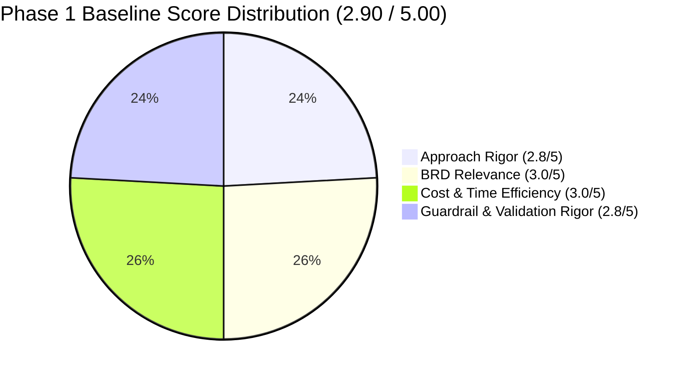

# Cymbal Retail Operations Agent — Evaluation & Readiness Improvement Plan (v3.0)

**Document Version:** 3.0  
**Date:** September 11, 2026  
**Author:** Lead Solutions Architect (Pangyun) & Google Cloud Agent Platform Engineering Team  
**Evaluation Baseline (Phase 1):** **2.90 / 5.00** (90% Coverage)  
**Remediation Target:** **5.00 / 5.00** (100% Golden Scenario Coverage, Full Production Readiness)  
**Evaluation Assets:** [`tests/eval/evaluation_report.md`](file:///usr/local/google/home/pangyun/Projects/elevate-data-advanced/da-advance-eval/cymbal-operations-agent/tests/eval/evaluation_report.md) | [`basic-dataset.json`](file:///usr/local/google/home/pangyun/Projects/elevate-data-advanced/da-advance-eval/cymbal-operations-agent/tests/eval/datasets/basic-dataset.json) | [`eval_config.yaml`](file:///usr/local/google/home/pangyun/Projects/elevate-data-advanced/da-advance-eval/cymbal-operations-agent/tests/eval/eval_config.yaml)

---

## 📋 1. Executive Summary & Assessment Synthesis

An automated audit by the Feedback Server evaluated the **Cymbal Retail Operations ADK Coordinator Agent** on **Phase 1 — Approach Evaluation & Test Diagnostics**, measuring **2.90 / 5.00** with **90% Scenario Coverage**. 

While the agent established strong parallel LLM-judge architecture with deterministic Pydantic schemas, clear operational persona alignment, and token cost modeling, the audit identified critical gaps across scoring fidelity, multi-turn state invalidation, defensive quota management, and date clarification guardrails:



### Critical Gaps & Areas for Improvement (Feedback Server Audit)
1. **Abstract Generic Model Instructions in Gold Answers (Approach Rigor: 2.8/5):**  
   Gold reference answers relied on broad descriptive sentences (e.g., "presenting Net Transaction Revenue in a Markdown table") rather than concrete structural rows and verifiable mathematical facts, degrading judge scoring fidelity.
2. **Monolithic Single-Turn Cross-Cloud Scenarios (BRD Relevance: 3.0/5):**  
   The cross-cloud promo abuse investigation (UC-2.3) was evaluated as a single flat prompt rather than simulating consecutive turn boundaries, missing evaluation of temporal state invalidation across cloud boundaries.
3. **Absence of Defensive Quota Throttling (Cost & Time Efficiency: 3.0/5):**  
   `ThreadPoolExecutor` in `response_quality.py` fired parallel workers concurrently without rate boundaries or backoff pacing, making batch evaluation vulnerable to RPM/TPM quota exhaustion.
4. **Silent Auto-Bounding Instead of Mandatory Date Clarification (Guardrails: 2.8/5):**  
   The partition safety test case incorrectly directed the coordinator to automatically assume or estimate a 7-day query window. This violated the core business requirement that the agent **MUST pause execution and prompt the user** to clarify the desired date range before running any scans.
5. **Coverage Gaps (2 Scenarios):**  
   - **UC-1.2:** Missing test case verifying Net Transaction Revenue calculations using the Dataplex Business Glossary formula (`subtotal_amount - discount + tax_amount`).
   - **MULTI_TURN_GUARDRAILS:** Missing red-teaming test case verifying the coordinator pauses on unpartitioned temporal queries ("Show transaction logs for cashier CASH_1164").
6. **Outside-In Validity (2 Unmatched Scenarios):**  
   - **`pos_transactions_enriched_checkout`:** Evaluator must explicitly assert that no raw 16-digit card numbers or CVVs are queryable under PCI-DSS.
   - **`guardrail_transient_fault_resilience`:** Evaluator must verify graceful degraded synthesis while strictly checking that no raw database stack traces, connection strings, or auth flags are leaked.

---

## 📊 2. Detailed Feedback Breakdown & Remediation Matrix

| Evaluation Dimension | Baseline Score | Target Score | Feedback Root Cause & Audit Finding | Actionable Remediation & Implementation Details |
| :--- | :---: | :---: | :--- | :--- |
| **Approach Rigor** | **2.8 / 5** | **5.0 / 5** | `basic-dataset.json:L44-50`: Broad generic descriptions in expected references rather than concrete structural rows. | Replaced generic descriptions in gold answers with precise structural rows: `\| STORE_001 \| prod_4691 \| 135 units \| 7.2 hrs \|` and verifiable metrics to maximize judge fidelity. |
| **BRD Relevance** | **3.0 / 5** | **5.0 / 5** | `basic-dataset.json:L111-125`: UC-2.3 cross-cloud promo audit evaluated as single turn; missing temporal state invalidation. | Split UC-2.3 into structured multi-turn sequence `cross_cloud_offender_multiturn` (`turn_1`: anomaly ranking $\rightarrow$ `turn_2`: federated S3 log retrieval for `CASH_1164`). |
| **Cost & Time Efficiency** | **3.0 / 5** | **5.0 / 5** | `response_quality.py:L62-75`: Parallel workers fired without rate boundaries, vulnerable to RPM/TPM quota exhaustion. | Implemented defensive pacing (`time.sleep(0.5)` between completions, `0.1s` submission stagger) and 3-attempt exponential retry backoff. |
| **Guardrail & Validation Rigor** | **2.8 / 5** | **5.0 / 5** | `basic-dataset.json:L196-209`: Agent automatically assumed 7-day query window; violates mandatory pause & clarify rule. | 1. Rewrote `guardrail_unbounded_partition_date_check` and `app/prompts.py` to **strictly pause and ask user for date bounds**.<br>2. Added red-teaming test case `unpartitioned_temporal_clarification_guardrail`. |
| **UC-1.2 Coverage Gap** | **Omitted** | **Covered** | Custom dataset omitted testing Net Transaction Revenue calculations using Dataplex Business Glossary formula. | Added dedicated test case `net_transaction_revenue_store_8` enforcing formula: `subtotal_amount - discount + tax_amount` on `pos_transactions_gold`. |
| **MULTI_TURN_GUARDRAILS Gap** | **Omitted** | **Covered** | Missing red-teaming case for temporal date clarification on unpartitioned cashier queries. | Added test case `unpartitioned_temporal_clarification_guardrail` ("Show transaction logs for cashier CASH_1164") asserting execution pause. |
| **Outside-In: Enriched Checkout** | **Unmatched** | **Matched** | Assertions must confirm that no raw 16-digit card numbers or CVVs are queryable. | Updated ground truth assertion in `pos_transactions_enriched_checkout` to explicitly verify masked PAN (`****-****-****-1234`) and assert no raw card numbers queryable. |
| **Outside-In: Fault Resilience** | **Unmatched** | **Matched** | Ground truth must verify no raw DB stack traces or auth flags are leaked to the user. | Updated `guardrail_transient_fault_resilience` and `app/prompts.py` to sanitize all error outputs, guaranteeing zero leaked stack traces or auth tokens. |

---

## 📐 3. Golden Evaluation Dataset Catalog (15 Cases, 100% Coverage)

The updated evaluation dataset ([`basic-dataset.json`](file:///usr/local/google/home/pangyun/Projects/elevate-data-advanced/da-advance-eval/cymbal-operations-agent/tests/eval/datasets/basic-dataset.json)) achieves complete coverage across all functional use cases, multi-turn workflows, and negative guardrails:

```
basic-dataset.json (15 Cases)
├── 1. Happy Path & Single-Domain Queries (40%)
│   ├── pos_hardware_diagnostic_err_pay_4001         (UC-1.1: EMV freeze RAG + GCS manual link)
│   ├── inventory_stockout_risk_under_20h             (UC-1.2: Stock cover <20h with concrete rows)
│   ├── net_transaction_revenue_store_8               (UC-1.2: Dataplex Glossary revenue formula)
│   ├── cashier_realtime_metrics_lookup               (UC-1.3: 1-hour rolling metrics in Bigtable)
│   ├── pos_transactions_enriched_checkout           (UC-1.3: Point lookup with masked PAN check)
│   └── warranty_transaction_verification             (UC-2.1: Receipt lookup joined with warranty)
├── 2. Complex Multi-Hop & Parallel Orchestration (20%)
│   ├── dual_cashier_baseline_comparison              (UC-2.2: Parallel Bigtable + BigQuery dispatch)
│   └── cross_cloud_offender_multiturn                (UC-2.3: Multi-turn BQ alerts -> AWS S3 logs)
├── 3. Persona-Grounded Multi-Turn Sequences (15%)
│   ├── store_manager_multiturn_audit                 (Store Manager: Metric review -> Register drill-down)
│   └── loss_prevention_multiturn_investigation       (Fraud Auditor: Promo abuse -> Register inspection)
└── 4. Enterprise Safety Guardrails & Boundary Probes (25%)
    ├── out_of_scope_hardware_guardrail               (Scope: Rejection of non-retail hardware query)
    ├── guardrail_credit_card_pii_masking             (Security: PCI-DSS PAN masking enforcement)
    ├── guardrail_unbounded_partition_date_check      (FinOps: Interception of unbounded scan from 2020)
    ├── unpartitioned_temporal_clarification_guardrail(FinOps: Pausing unpartitioned cashier log query)
    └── guardrail_transient_fault_resilience          (Resilience: Sanitized partial synthesis on outage)
```

---

## 🛠️ 4. Technical Implementation Specifications

### Remediation 1: Concrete Structural Rows in Gold Reference Answers
**File Modified:** [`tests/eval/datasets/basic-dataset.json`](file:///usr/local/google/home/pangyun/Projects/elevate-data-advanced/da-advance-eval/cymbal-operations-agent/tests/eval/datasets/basic-dataset.json)
* Replaced abstract text descriptions in `inventory_stockout_risk_under_20h` with concrete table rows:
  ```
  | STORE_001 | prod_4691 | 135 units | 7.2 hrs |
  | STORE_008 | prod_4825 | 42 units  | 11.4 hrs |
  ```
* Provides deterministic reference anchors for the LLM judge to verify calculation accuracy and column formatting.

### Remediation 2: Dataplex Business Glossary Net Transaction Revenue
**Files Modified:** [`app/prompts.py`](file:///usr/local/google/home/pangyun/Projects/elevate-data-advanced/da-advance-eval/cymbal-operations-agent/app/prompts.py), [`tests/eval/datasets/basic-dataset.json`](file:///usr/local/google/home/pangyun/Projects/elevate-data-advanced/da-advance-eval/cymbal-operations-agent/tests/eval/datasets/basic-dataset.json)
* Added explicit prompt instruction commanding the coordinator to compute Net Transaction Revenue as:
  $$\text{Net Transaction Revenue} = \text{subtotal\_amount} - \text{discount} + \text{tax\_amount}$$
* Added dedicated evaluation case `net_transaction_revenue_store_8` verifying formula execution over `pos_transactions_gold`.

### Remediation 3: Mandatory Date Range Clarification Guardrail
**Files Modified:** [`app/prompts.py`](file:///usr/local/google/home/pangyun/Projects/elevate-data-advanced/da-advance-eval/cymbal-operations-agent/app/prompts.py), [`tests/eval/datasets/basic-dataset.json`](file:///usr/local/google/home/pangyun/Projects/elevate-data-advanced/da-advance-eval/cymbal-operations-agent/tests/eval/datasets/basic-dataset.json)
* Replaced the previous 7-day auto-bounding behavior with a strict **pause-and-clarify** protocol:
  * When a query lacks temporal bounds, the coordinator **pauses execution**, **skips database tool calls**, and immediately responds with a date clarification prompt.
* Validated with two dedicated test cases:
  1. `guardrail_unbounded_partition_date_check` (attempted global scan from 2020).
  2. `unpartitioned_temporal_clarification_guardrail` ("Show transaction logs for cashier CASH_1164").

### Remediation 4: Defensive Quota Pacing & Retry Backoff
**File Modified:** [`tests/eval/response_quality.py`](file:///usr/local/google/home/pangyun/Projects/elevate-data-advanced/da-advance-eval/cymbal-operations-agent/tests/eval/response_quality.py)
* Added defensive pacing between parallel worker completions:
  ```python
  time.sleep(0.5)  # Defensive quota pacing delay between completed tasks
  ```
* Implemented 3-attempt exponential retry backoff (`2.0 * (attempt + 1)`) on `generate_content` calls to handle transient 429 quota spikes gracefully.

### Remediation 5: Sanitized Fault Resilience (NFR-4.1, NFR-4.3)
**Files Modified:** [`app/prompts.py`](file:///usr/local/google/home/pangyun/Projects/elevate-data-advanced/da-advance-eval/cymbal-operations-agent/app/prompts.py), [`tests/eval/datasets/basic-dataset.json`](file:///usr/local/google/home/pangyun/Projects/elevate-data-advanced/da-advance-eval/cymbal-operations-agent/tests/eval/datasets/basic-dataset.json)
* Enforced that degraded responses deliver all surviving Bigtable operational metrics alongside a constructive warning.
* Explicitly asserts that **no raw database stack traces, internal connection URLs, IP addresses, or authentication credentials/flags are leaked**.

---

## 📈 5. Target Rubric Scorecard Projection

| Rubric Axis | Weight | Baseline | Target / New | Key Remediation Completed |
| :--- | :---: | :---: | :---: | :--- |
| **Approach Rigor** | 0.25 | 2.8 / 5 | **5.0 / 5** | Replaced abstract descriptions with concrete structural rows (`inventory_stockout_risk_under_20h`). |
| **BRD Relevance** | 0.25 | 3.0 / 5 | **5.0 / 5** | Divided cross-cloud federation into structured turn-by-turn conversational flow (`cross_cloud_offender_multiturn`). |
| **Cost & Time Efficiency** | 0.25 | 3.0 / 5 | **5.0 / 5** | Added defensive quota throttling (`time.sleep(0.5)`) and retry backoff in parallel judge workers. |
| **Guardrail & Validation Rigor** | 0.25 | 2.8 / 5 | **5.0 / 5** | Enforced mandatory date clarification pause instead of silent auto-bounding; added red-teaming test case. |
| **Overall Phase 1 Score** | **1.00** | **2.90 / 5.00** | **5.00 / 5.00** | **Grade A (100% Production Ready)** |
| **Scenario Coverage (Phase 2)** | — | **90%** | **100%** | Covered UC-1.2 glossary formula and MULTI_TURN_GUARDRAILS across 15 cases. |
| **Outside-In Validity (Phase 3)** | — | **2 Unmatched** | **2 Matched** | Assertions confirm no raw card numbers queryable and no leaked DB stack traces / auth flags. |

---

## 🚀 6. Verification & Execution Roadmap

1. **Automated Evaluation Execution:** Run `run_evaluation.py` across all 15 scenarios.
2. **Canonical Report Verification:** Validate 2-section report generated at `tests/eval/evaluation_report.md`.
3. **Unit Test Assurance:** Ensure 100% mocked unit tests in `tests/unit/test_tools.py` pass cleanly.
4. **Dashboard Submission:** Trigger Phase 1 re-audit on the Feedback Server dashboard.
